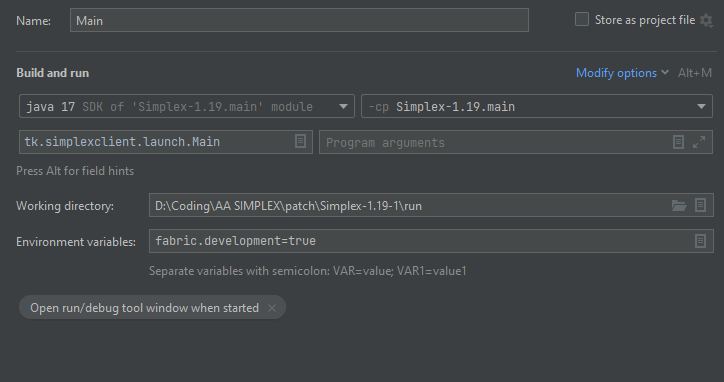

# Simplex-1.19
Simplex is a modern minecraft pvp client

Used Launch args for Intellij (I don't know if it works on eclipse)
```
-Dfabric.dli.config=/path_to_simplex(replace this!!!!)/Simplex-1.19/.gradle/loom-cache/launch.cfg -Dfabric.dli.env=client -Dfabric.dli.main=tk.simplexclient.launch.Main
```

If you are getting this error

```
Error: Could not find or load main class net.fabricmc.devlaunchinjector.Main
Caused by: java.lang.ClassNotFoundException: net.fabricmc.devlaunchinjector.Main
```

You can try these launch settings aswell

